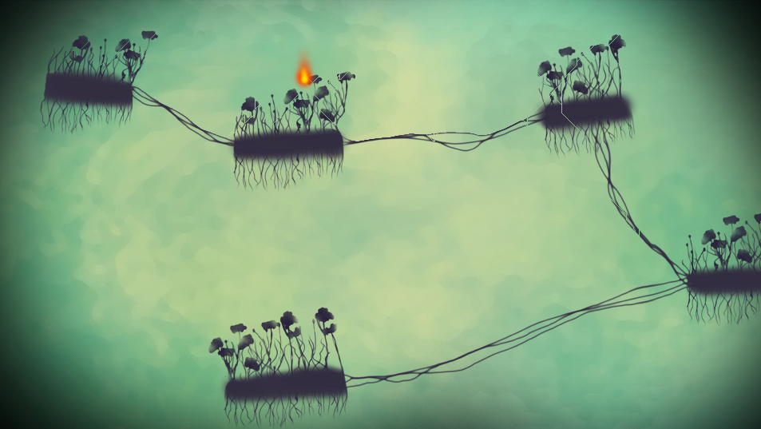

# FireGame

An (unfinished) attempt at making a plattform game where you are a fire and have to move on burnable material.

## Credits
**Torbjørn Vik Lunde**: Concept, programming
**Ingrid Kjensli Moe**: Concept, level design, art
**Simon Matthew Jones-Tyridal**: Soundtrack

## Instructions for OS X

### 1. Open the project using [IntelliJ](http://www.jetbrains.com/idea/download/)
- Install it if you don’t have it

### 2. Add processing to the project module from global libraries
- Install [Processing](http://processing.org) if you don’t have it.
- Go to File -> Project Structure -> Global Libraries
- If ‘core’ library from processing is not in the list you need to add it. Plus icon -> Java. Browse to /Applications/Processing.app/Contents/Java/core/library/core.jar.
- Right click ‘core’ -> Add to modules -> Select Fire game -> Ok.

### 3. Add minim (sound) libraries to the project module from global libraries.
- Go to File -> Project Structure -> Global Libraries
- If minim libraries is not in the list you need to add it (it is one entry that includes many classes). Plus icon -> Java. Browse to /Applications/Processing.app/Contents/Java/modes/java/libraries/minim/library/ and select all the *.jar files in that directory. Click ok.
- Right click ‘minim’ -> Add to module -> Select Fire Game -> Ok.

### 4. Set up Run configuration

#### Windowed
- Beside the Run -> Edit configurations -> Plus icon -> Application.
- Give it a name like "Run"
- Choose "Main" in main Class.
- Write "Main" in program arguments

#### Full screen
- Same as above, but…
- Write "--present Main" in program arguments

### 5. Hit play!
